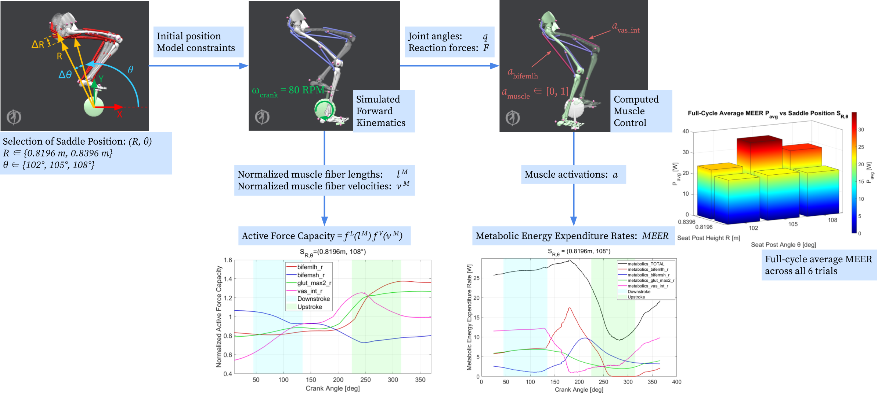

Date updated: 4/01/2021

What is the "Full_Workflow" folder?
This the folder the Stanford student team stored all of the different OpenSim models and results for the simulations performed at the end of the winter quarter in 2021.

For a visual reference, here is the summary workflow diagram from the student team.

# Order of Operations (as performed by the student team)
## Setup
1. Select a seat tube height (radius R) and seat tube angle (angle θ).
2. Calculate the cartesian coordinates of the saddle position using R and θ.

## Simulated Forward Kinematics
3. Go to the "Simulated_Forward_Kinematics" folder, copy (and rename) one of the .osim files, and change the x,y coordinates of the pelvis coordinate frame to be equal to the calculated cartesian coordaintes.
4. Update SFK set-up .xml file with correct results directory for the chosen R and θ.
5. Load the newly created .osim in OpenSim 4.1. Use the Forward Dynamics Tool to run a simulation with the new saddle position.

### Post-Processing of PedalClip reaction forces
6. After the simulation is successfully run, use the "write_forces.m" script to process the reaction forces due to the PedalClip constraint to use in the CMC simulations.

## Computed Muscle Control
7. Go to the "Computed_Muscle_Control" folder, copy (and rename) one of the .osim files, and change the x,y coordinates of the pevlis coordinate frame to be EXACTLY THE SAME AS THE VALUES FOR THE .osim USED FOR SFK.
8. Update CMC set-up .xml file with correct model file, results directory, external loads file, and desired kinematics file for the chosen R and θ.
9. Open the new model in OpenSim 4.1. Use the Computed Muscle Control Tool to [attempt] to run a simulation with the new saddle position.
10. If the simulation fails, open the "cmc_leg_Actuators.xml" file, and adjust the values for the optimal_force on the CoordinateActuator on the crank_angle. The student team limited adjustments between trials to just this value to help maintain consistency. There is a "sweet spot" for this optimal force for each saddle position.
11. Attempt to run a CMC simulation with the updated .xml for Actuators by re-loading in the newly saved set-up file. It is important to re-load in the file for best results.
12. Once a successful simulation is completed, all of the metabolic output data should be stored in the "Results" folder.

## Plotting the Data
13. Open the MATLAB script "plot_metabolics_and_active_force.m". Adjust the values in the first block for the theta and radius vectors to analyze the data for a subset of trials.